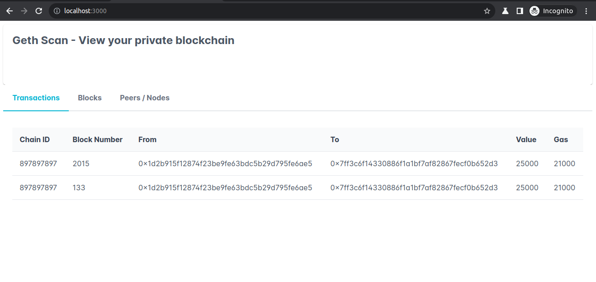

# geth-scan

Used to scan a geth network and view its content on a webpage.

## Technologies

Blockchain network: geth
API Server: NodeJS, ExpressJS, Web3.js application
UI: ReactJS

## UI

Transactions:

## Geth Private Network

Ref doc: <https://geth.ethereum.org/docs/fundamentals/private-network>

Commands to start blockchain nodes

### Start bootnode

`geth --datadir <FOLDER_NAME> --networkid <CHAIN_ID_FROM_GENESIS.JSON> --nat extip:127.0.0.1 console`

### Start member node 1

`geth --datadir <FOLDER_NAME> --port 30306 --bootnodes enode://<HASH>@127.0.0.1:30303 --networkid <CHAIN_ID_FROM_GENESIS.JSON> --unlock <PUBLIC_ADDRESS_KEY_OF_MEMBER_NODE_1> --password <FOLDER_NAME>/password.txt --authrpc.port 8552 --mine --miner.etherbase <PUBLIC_ADDRESS_KEY_OF_MEMBER_NODE_1> console`

### Start member node 2

`geth --datadir <FOLDER_NAME> --port 30307 --bootnodes enode://<HASH>@127.0.0.1:30303 --networkid <CHAIN_ID_FROM_GENESIS.JSON> --unlock <PUBLIC_ADDRESS_KEY_OF_MEMBER_NODE_2> --password <FOLDER_NAME>/password.txt --http --http.port 8553 --http.addr 127.0.0.1 --http.corsdomain '*' --http.api admin,personal,eth,net,web3 --authrpc.port 8554 --allow-insecure-unlock console`
